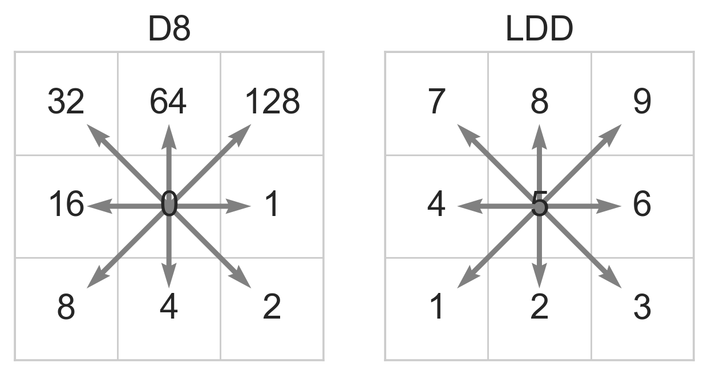

.. currentmodule:: pyflwdir

.. ipython:: python
   :suppress:

    import matplotlib
    import matplotlib.pyplot as plt
    import cartopy.crs as ccrs
    import numpy as np
    # set matplotlib parameters
    matplotlib.rcParams['savefig.bbox'] = 'tight'
    matplotlib.rcParams['savefig.dpi'] = 128
    plt.style.use('seaborn-whitegrid')
    plt.close('all')

Flow direction data
===================

The :py:class:`~pyflwdir.FlwdirRaster` object is at the core of the pyflwdir package.
It contains gridded flow direction data, parsed to an actionable common format
describing the linear index of the next dowsntream cell.

Currently we support two local flow direction data types: **D8** and **LDD** and one global
flow direction type: **NEXTXY**. Local flow direction data types describe the next 
downstream cell based on a local direction, while global flow direction types describe
the next downstream cell based on a global index. The D8 and LDD flow direction types
are shown in the image below

Most examples in the documentation are based on D8 data, but unless mentioned otherwise,
the methods of FlwdirRaster support any of the aforementioned flow direction data types.

Getting Started
---------------

Here we show an example of a 30 arcsec D8 map of the Rhine basin which is saved in 
as 8-bit GeoTiff. We read the flow direction and eleveation data, including meta-data 
using rasterio to begin with.

.. ipython:: python

    # import rasterio and read D8 flow direction data
    import rasterio
    with rasterio.open('../data/rhine_d8.tif', 'r') as src:
        flwdir = src.read(1)
        transform = src.transform
        latlon = src.crs.to_epsg() == 4326
    with rasterio.open('../data/rhine_elv0.tif', 'r') as src:
        elevtn = src.read(1)

Next, we parse this data to a :py:class:`~pyflwdir.FlwdirRaster` object, the core object 
to work with flow direction data. The most common way to initialize a `FlwdirRaster` object 
is based on gridded flow direction data in D8, LDD or NEXTXY format using 
the :py:func:`pyflwdir.from_array` method. Optional arguments describe the geospatial
location of the gridded data. In this step the D8 data is parsed to an actionable format.

.. ipython:: python

    import pyflwdir
    flw = pyflwdir.from_array(flwdir, ftype='d8', transform=transform, latlon=latlon)
    # When printing the FlwdirRaster instance we see its attributes. 
    print(flw)

We can than make use of the many methods of the FlwdirRaster object, see :ref:`reference`.

Streams
-------

For instance, :py:meth:`~pyflwdir.FlwdirRaster.stream_order` returns a map with the 
Strahler order of each cell. 
We can then use the vectorize method to return a :py:class:`geopandas.GeoDataFrame` 
object which we use for visualization.

First we setup a helper make some quick plots later.

.. ipython:: python

    def quickplot(gdfs=[], maps=[], hillshade=True):
        """Create quick plots of geospatial data."""
        fig = plt.figure()
        ax = fig.add_subplot(projection=ccrs.PlateCarree())
        # plot hillshade background
        if hillshade:
            ls = matplotlib.colors.LightSource(azdeg=115, altdeg=45)
            hillshade = ls.hillshade(np.ma.masked_equal(elevtn, -9999), vert_exag=1e3)
            ax.imshow(hillshade, origin='upper', extent=flw.extent, cmap='Greys', alpha=0.3, zorder=0)
        # plot geopandas GeoDataFrame
        for gdf, kwargs in gdfs:
            gdf.plot(ax=ax, **kwargs)
        for data, nodata, kwargs in maps:
            ax.imshow(np.ma.masked_equal(data, nodata), origin='upper', extent=flw.extent, **kwargs)
        return ax

.. ipython:: python
    
    stream_order = flw.stream_order()
    gdf = flw.vectorize(mask=stream_order>3)
    gdf['stream_order'] = stream_order.flat[gdf.index.values]
    streams = (gdf, dict(column='stream_order', cmap='Blues'))
    @savefig stream_order.png width=60%
    quickplot([streams], maps=[], hillshade=True);

Basins
------

All cells draining to an defined cells can be delineated using the 
:py:meth:`~pyflwdir.FlwdirRaster.basins` method. The method by deafault delineates 
all cells flowing to the outlet, but if point locations are provided we can delineate 
subbasins using the same method. The streams argument is added to make sure the points 
are snapped to streams with a minimum Strahler order of 4, using the 
:py:meth:`~pyflwdir.FlwdirRaster.snap` method under the hood.

.. ipython:: python

    # define output locations
    x, y = np.array([4.67916667, 7.60416667]), np.array([51.72083333, 50.3625])
    # delineate subbasins
    subbasins = flw.basins(xy=(x,y), streams=stream_order>4)
    # add subbasins to map
    streams = (gdf[gdf['stream_order']>=6], dict(color='grey'))
    subbas = (subbasins, 0, dict(cmap='Set3', alpha=0.5))
    @savefig subbasins.png width=60%
    quickplot([streams], [subbas], hillshade=True);

Flow paths
----------

To trace flow paths downstream from a point, for instance to trace polutants from a 
point source, we can use the :py:meth:`~pyflwdir.FlwdirRaster.path` method. Here 
we trace three point sources along a maximum distance of 400 km.

.. ipython:: python

    # flow paths return the list of linear indices and a list of distances
    paths, dist = flw.path(
        xy=([8.92, 5.55, 8.50], [50.28, 49.80, 47.3]), 
        max_length=400e3, 
        unit='m'
    )
    # we use these paths to set flags in an array
    mask = np.zeros(flw.shape, dtype=np.bool)
    for i, path in enumerate(paths):
        mask.flat[path] = 1
    # which we than use to vectorize an plot 
    gdf_paths = flw.vectorize(mask=mask)
    @savefig flow_paths.png width=60%
    quickplot([streams, (gdf_paths, dict(color='blue'))], maps=[], hillshade=True);

Floodplains
-----------

A simple method to delineate geomorphic floodplain boundaries is based on a power-law
relation between upstream area and height above the nearest stream, 
see :py:meth:`~pyflwdir.FlwdirRaster.hand`. Here, streams are defined based on 
a minimum upstream area threshold `upa_min` and the scaling parameters `b` is an 
argument for the floodplains method. 

.. ipython:: python

    floodplains = flw.floodplains(elevtn=elevtn, upa_min=1000, b=0.3)
    floodmap = (floodplains, -9999, dict(cmap='Blues', alpha=0.3, vmin=0))
    @savefig floodplains.png width=60%
    quickplot([streams], [floodmap], hillshade=True);

