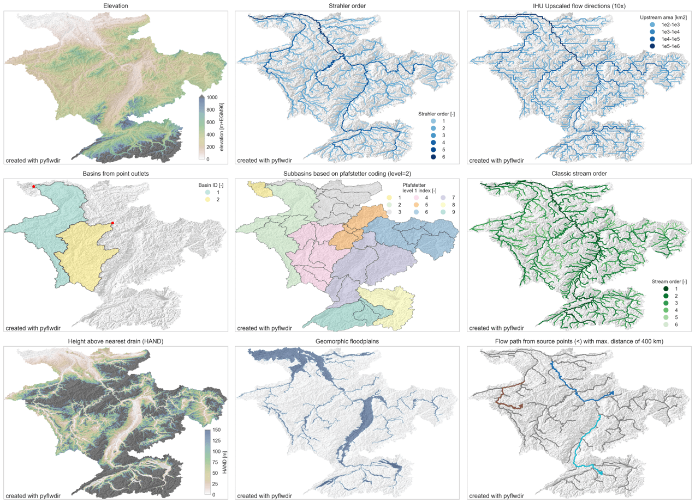

===============================================================================
PyFlwdir: Fast methods to work with hydro- and topography data in pure Python.
===============================================================================

Intro
-----

PyFlwDir contains a series of methods to work with gridded DEM and flow direction 
datasets, which are key to many workflows in many earth siences. Pyflwdir supports several 
flow direction data conventions and can easily be extended to include more. 
The package contains some unique methods such as Iterative Hydrography Upscaling (IHU) 
method to upscale flow directions from high resolution data to coarser model resolution. 

Pyflwdir is in pure python and powered by numba to keep it fast.

Featured methods
----------------

- flow directions from elevation data using a steepest gradient algorithm
- strahler stream order
- flow direction upscaling
- (sub)basin delineation
- pfafstetter subbasins delineation
- classic stream order
- height above nearest drainage (HAND) 
- geomorphic floodplain delineation
- up- and downstream tracing and arithmetics
- hydrologically adjusting elevation
- upstream accumulation
- vectorizing streams
- many more!

.. toctree::
  :maxdepth: 1
  :caption: Getting Started

  Installation <installation>
  Quickstart <quickstart>
  Background <background>

.. toctree::
  :maxdepth: 1
  :caption: User Guide
  
  Flow direction data <flwdir>
  Flow directions from elevation data <from_dem>
  Deliniation of (sub)basins <basins>
  Stream order <streams>
  Tracing flow directions <tracing>
  Elevation indices <elevation_indices>
  Flow direction upscaling <upscaling>

.. toctree::
  :maxdepth: 1
  :caption: Reference Guide

  API reference <reference>
  Changelog <changelog>

.. toctree::
  :maxdepth: 1
  :caption: Developer Guide

  Contributing to PyFlwDir <contributing>
  Github repository <https://github.com/Deltares/pyflwdir>

Indices and tables
------------------

* :ref:`genindex`
* :ref:`modindex`
* :ref:`search`
